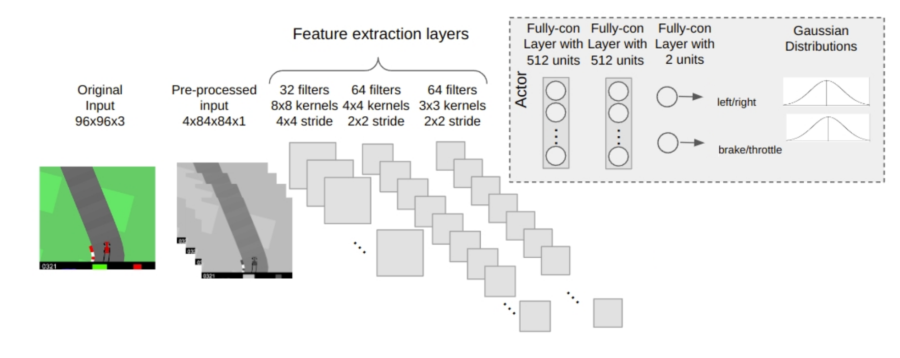

# Clonagem comportamental

Aprendizado por imitação é uma abordagem pela qual um modelo caixa-preta (rede neural) é treinado para imitar um especialista usando um conjunto fixo de amostras de pares observação-ação (ou trajetórias) obtidas daquele especialista.

 A clonagem comportamental (CC) é um tipo de aprendizagem por imitação baseada em um processo de treinamento supervisionado de um modelo (rede neural) usando um grande conjunto de dados rotulados. A CC tem sido utilizada para a obtenção de políticas de condução autônoma para veículos, onde as amostras de treinamento são geradas por motoristas humanos: a entrada da rede neural é a imagem da câmera do carro, enquanto a saída desejada corresponde ao atuador (ação do motorista: aceleração, direção, freio).

...

## 1. Simulação e Coleta de Dados:

+ (a) O simulador utilizado coletar dados de treinamento e realizar a clonagem comportamental foi  o [CarRacing-v0](https://github.com/openai/gym/blob/master/gym/envs/box2d/car_racing.py), que é um problema de controle contínuo a partir de imagens RGB.

+ (b) Os dados passam por um processo de pré-processamento, tornando a imagem P&B e colocando-a em um stack de espaço 4. As ações no simulador se encontram no formato [steering, brake, throttle].

## 2. Treinamento e Avaliação:
+ (a) A arquitetura da rede neural é uma CNN, conforme definido na imagem a seguir:

## 3. Como rodar esse código:

No diretório "src", basta rodar o seguinte comando:

``
make run
``

O Makefile irá criar o ambiente virtual e baixar as bibliotecas necessárias. Logo em seguida, irá executar o código em main.py, o qual contém funções para treinar a rede neural, avaliar e testar o data set.

Para ver os plots da fitness, basta rodar o comando:

``
make plot
``

### [Importante] 

...

### Links de referência:

1. Regressão e CNNs em pyTorch:
 - https://pytorch.org/tutorials/recipes/recipes/defining_a_neural_network.html
 - https://medium.com/@benjamin.phillips22/simple-regression-with-neural-networks-in
 - https://www.guru99.com/pytorch-tutorial.html
 - https://colab.research.google.com/drive/1IWRgLeTug-7NphtB54iDz8aJEi_OpWbQ?usp=sharing
2. Artigos de referência em BC:
...
